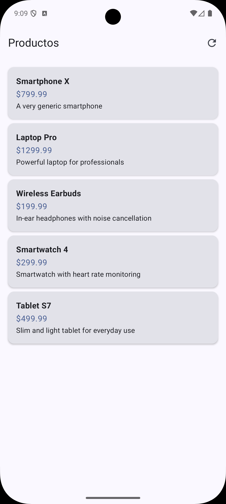

# Nav3 Samples

A modern Android application that demonstrates advanced navigation patterns using Navigation3 with Jetpack Compose. The app showcases adaptive UI with two-pane layouts for different screen sizes, product listing, and detailed product views.

## App Description

Nav3 Samples is a demonstration app that shows how to implement modern navigation patterns in Android applications. It features:

- Product catalog browsing
- Detailed product information views
- Adaptive UI that shows two-pane layouts on larger screens
- State management with ViewModels
- Error handling and loading states

## Screenshots and Demo

<table>
  <tr>
    <td width="50%">
      
    </td>
    <td width="50%">
      

https://github.com/user-attachments/assets/8dbee446-aa22-4e34-b587-d0a523e0faab

    </td>
  </tr>
</table>

## Tech Stack

### UI
- **Jetpack Compose** - Modern declarative UI toolkit
- **Material 3** - Latest Material Design components and theming
- **Adaptive Layout** - Support for different screen sizes and orientations

### Navigation
- **Navigation3** - Next generation navigation framework
- **Two-Pane Layout** - Advanced UI patterns for larger screens
- **Scene Strategy** - Custom navigation transitions

### Architecture & State Management
- **ViewModel** - Lifecycle-aware data holders
- **StateFlow** - Reactive state container
- **Kotlin Coroutines** - Asynchronous programming
- **BaseViewModel** - Abstracted state management

### Other
- **Kotlinx Serialization** - Modern JSON serialization
- **Gradle Version Catalog** - Dependency management

## Requirements

- Android Studio Meerkat or newer
- Minimum SDK: 24
- Target SDK: 36
- JDK 11

## Getting Started

1. Clone the repository
2. Open the project in Android Studio
3. Sync the project with Gradle files
4. Run the app on an emulator or physical device

## Implementation Details

The app demonstrates modern Android development practices including:
- Clean separation of UI and business logic
- State-based UI rendering with Compose
- Adaptive layouts for different screen sizes
- Error handling and loading states management
- ViewModel integration with Navigation3
